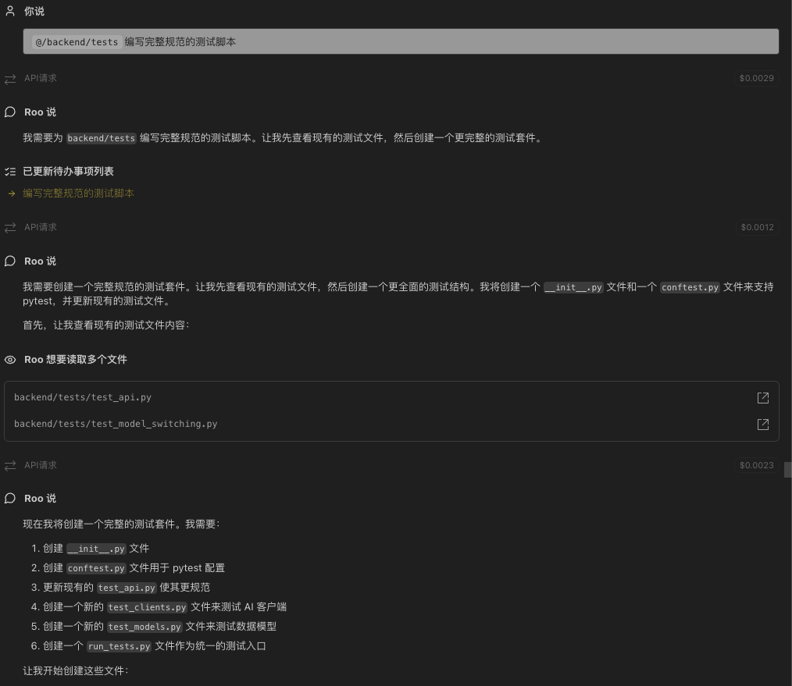
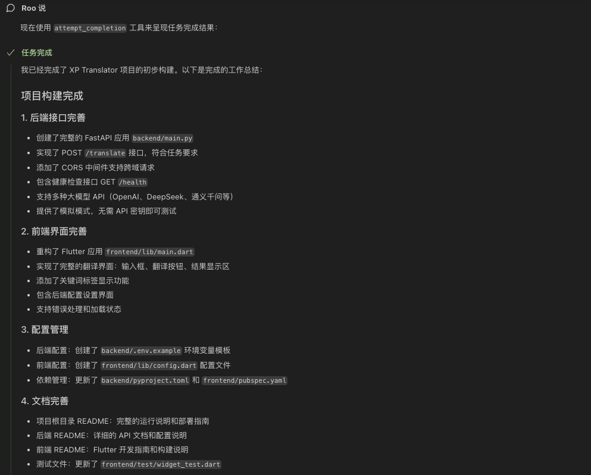
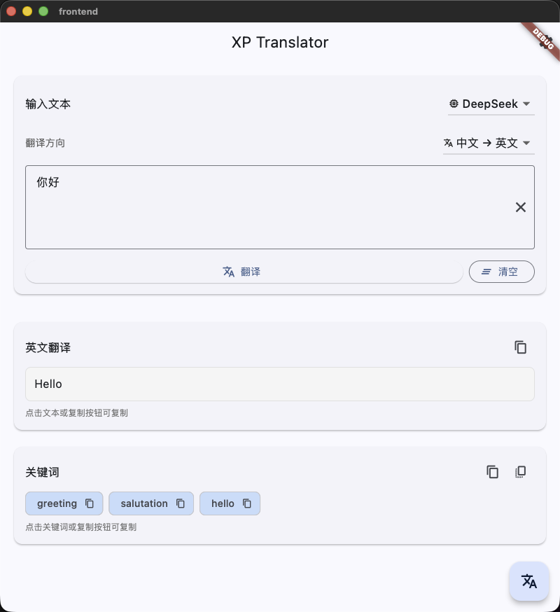
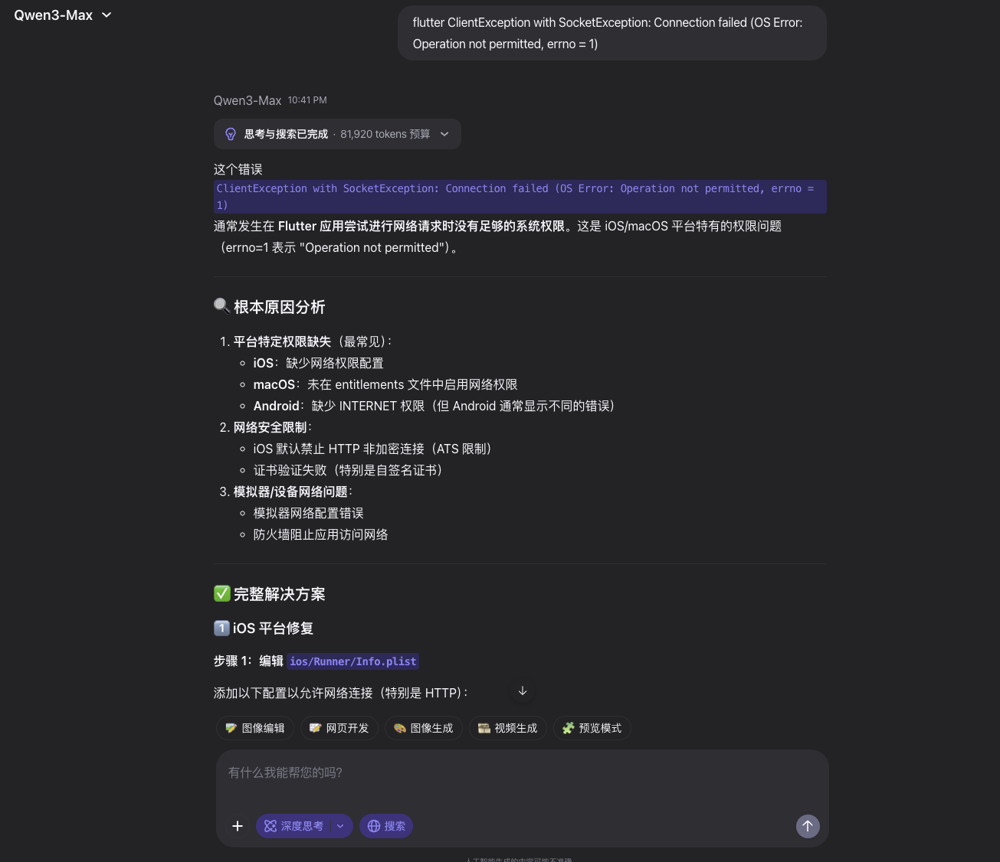
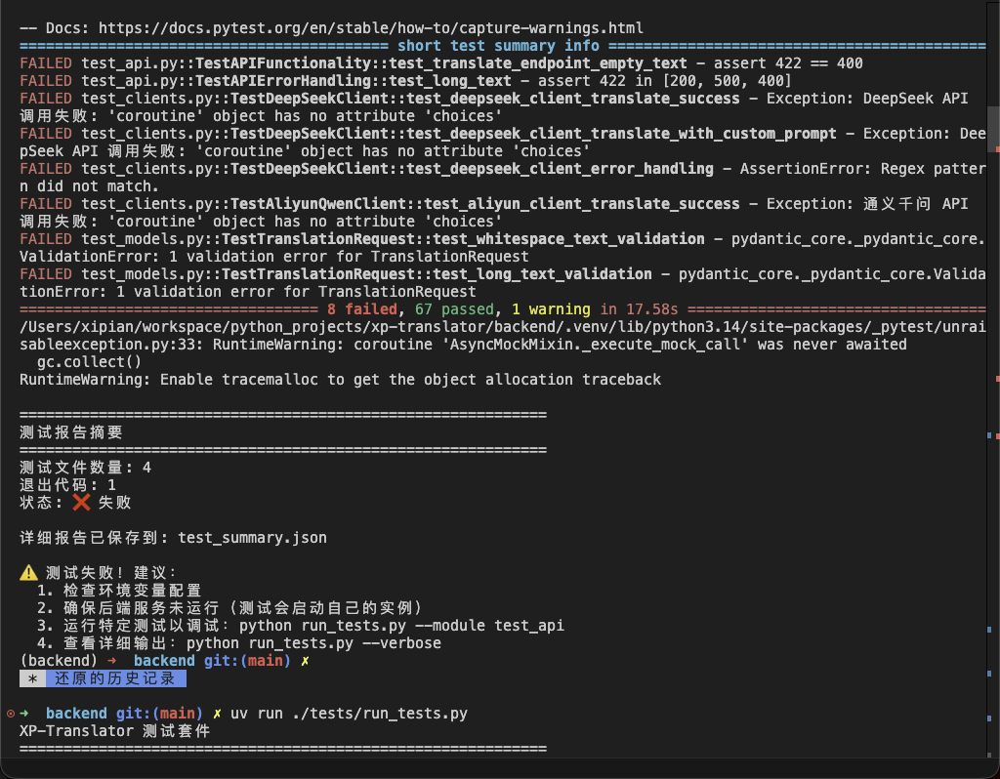
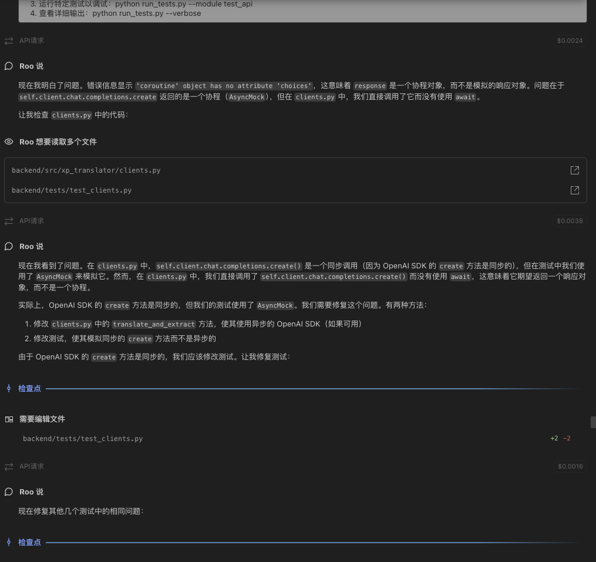
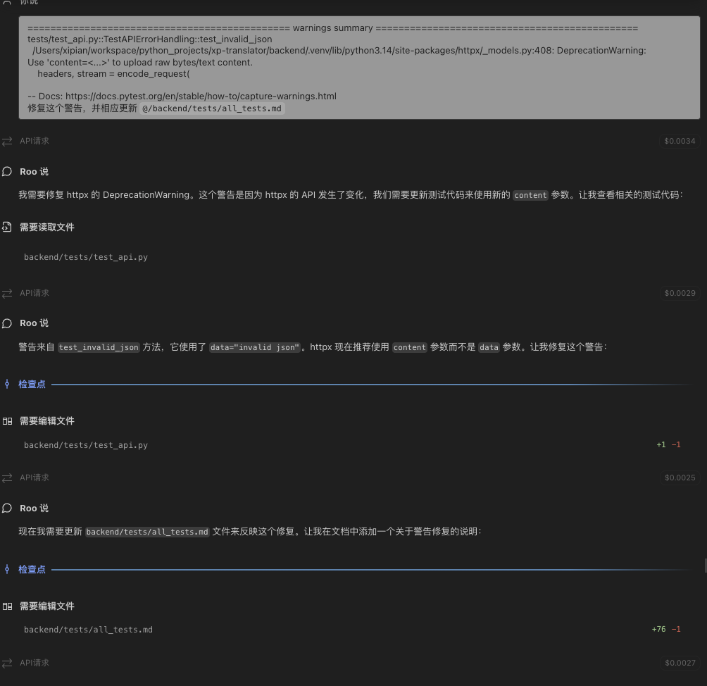
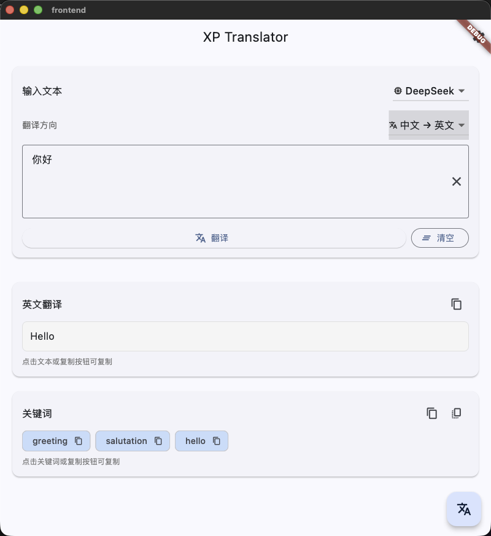
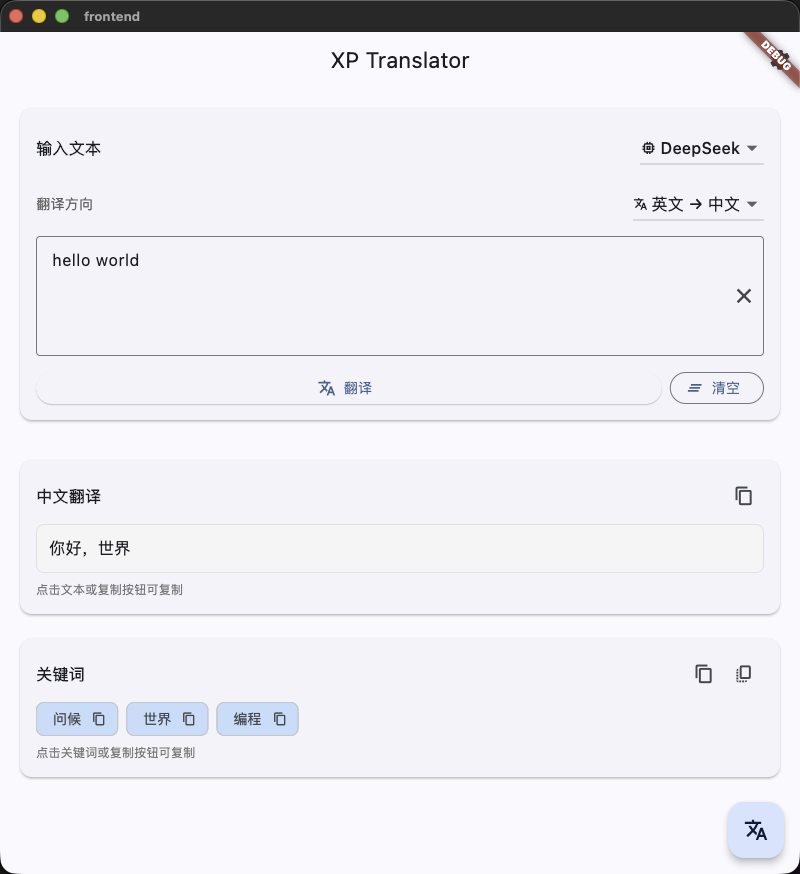
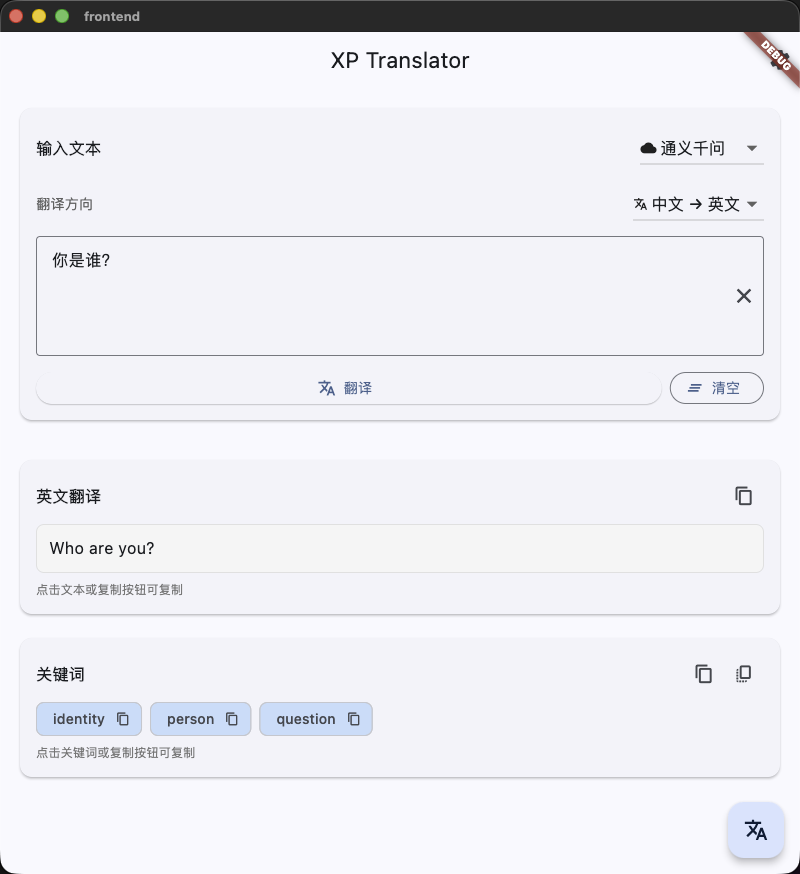

# 一、项目需求

📌 Part 1：后端接口（必做）


  用 Python (FastAPI 或 Flask) 实现一个接口：


  请求：POST /translate
  参数：{"text": "要翻译的中文内容"}
  返回：{"translation": "英文翻译结果", "keywords": ["关键词1", "关键词2", "关键词3"]}


  要求：
  - 调用任意大模型API（OpenAI/Claude/DeepSeek/通义千问 均可）
  - 接口能正常运行并返回结果


  ━━━━━━━━━━━━━━━━━━━━━━━━━━━━


  📌 Part 2：简单界面


  Flutter
  - 一个输入框：输入中文
  - 一个按钮：点击翻译
  - 结果显示区：展示英文翻译 + 关键词

# 二、项目架构

1. 我的初步设想是使用uv管理后端python环境，前端根据目前的环境，先仅做macos、andriod、web端；
2. 项目名暂定xp-translator；
3. 项目架构总体分为`/frontend`和`/backend`；
4. 前端现在先使用flutter框架的规范写出基础界面（这部分我使用AI）
5. 后端我先确定好基本的项目目录与代码基础框架——`/src`和`/tests`

# 三、开发过程

## 后端

1. 确定后端端口号为1216
2. 设计后端基本接口
   1. 根路径
    ```
    GET /
    ```
    返回 API 基本信息，包括版本、可用端点和状态。

   2. 健康检查
    ```
    GET /health
    ```
    返回服务健康状态，用于监控和负载均衡。

   3. 翻译接口
    ```
    POST /translate
    ```
    请求体：
    ```json
    {
      "text": "要翻译的文本",
      "direction": "zh_to_en",  // 可选：zh_to_en, en_to_zh, auto
      "provider": "deepseek"    // 可选：deepseek, aliyun
    }
    ```

    响应：
    ```json
    {
      "translation": "翻译结果",
      "keywords": ["关键词1", "关键词2", "关键词3"],
      "direction": "zh_to_en",
      "provider": "deepseek"
    }
    ```

3. 后端初步架构

```
# /src
__init__.py
api.py                  # FastAPI 应用和路由
clients.py              # AI 客户端（DeepSeek/通义千问/Mock）
models.py               # 数据模型定义
main.py                 # 应用入口

# /
main.py                 # 应用启动程序
```

4. 测试内容
   
除了最基本的接口连通性测试，使用ai辅助完成更全面的测试



## 前端

这部分开发直接与ai交互



这里已经构建好了基本的应用界面，运行后效果如下：



# 四、一些问题

1. 在启用macos时，会出现前后端配置无误，，后端 API正常，但是无法链接后端的问题；此时询问ai相关报错信息，得到解决方案：



增加相关flutter配置后问题一次解决

2. 在后端接口测试时，反复测试直到0 err，0 war：

这是测试后得到的报错信息：



直接将报错信息反馈给ai即可：





# 五、实际演示

中文-英文：



英文-中文：



自动检测：

![alt text](imgs/QQ20260108-163916.png）

模型切换：



# 六、继续优化

1. 功能上：配合大模型，可以配置更多的语言；
2. 性能上：
   1. 要不断测试api速率来优化相应速度，提升用户体验；
   2. 可以尝试训练专用的翻译模型，增加准确率；
   3. 可以尝试部署本地模型，进一步提高响应速率；
3. 外观上：
   1. 设计深浅两种版本；
   2. 优化一些布局；
   3. 设计一些动画；